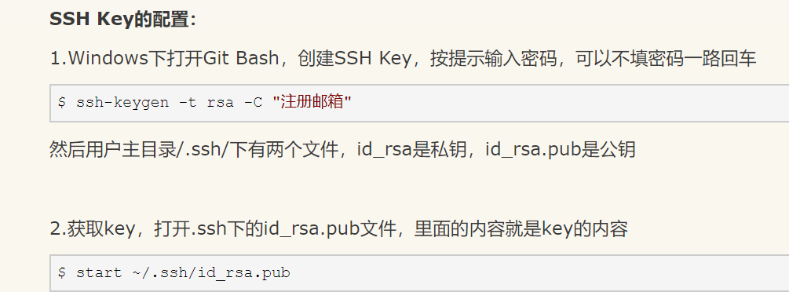
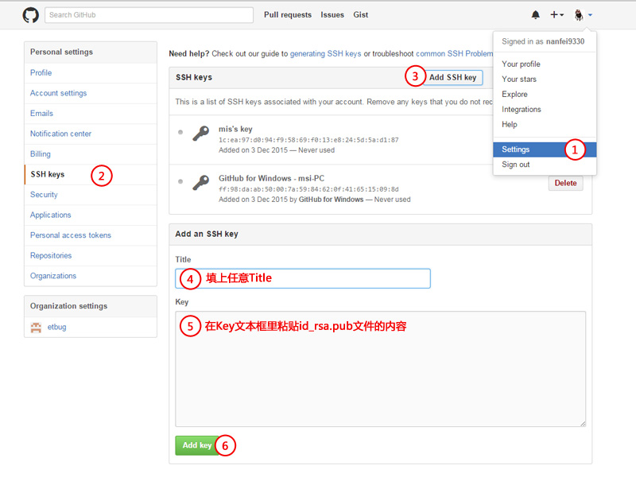
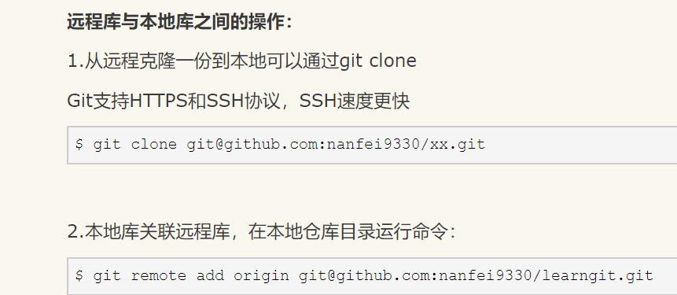
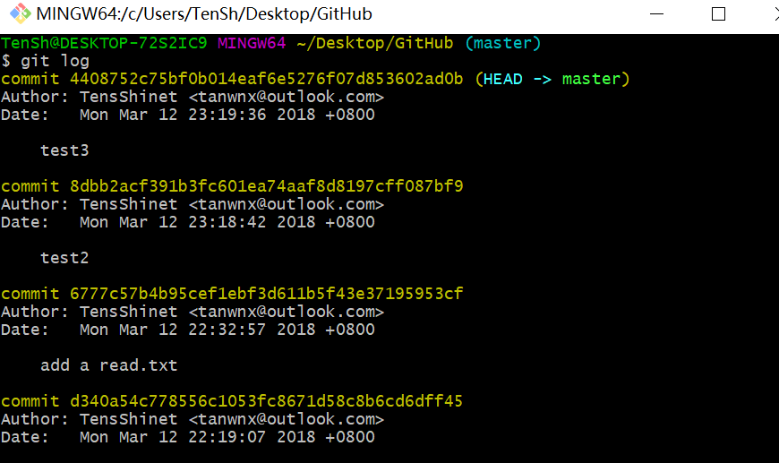
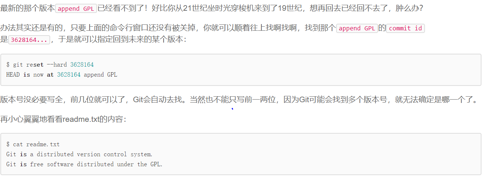
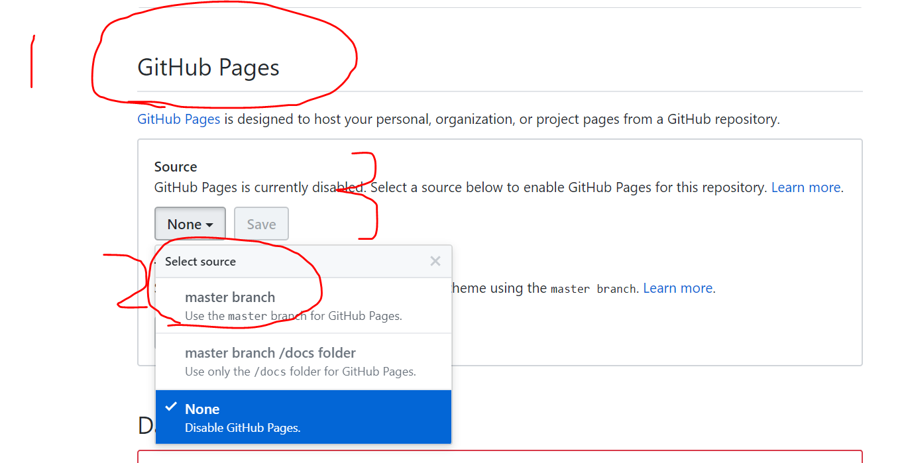

### GitHub
<h3>写在前面</h3>
<p>
如何连接已有的git, 仓库<br>
</p>




<h4> 1. 命令创建仓库</h4>


    <h6>建立一个新的仓库</h6>

   
   <p>
   $ mkdir learngit<br>
   $ cd learngit<br>
   $ pwd<br>
   前两个是创建一个仓库, 最后一个命令是看git在哪
   </p>
<h4>2. 命令初始化仓库</h4>


<p>这个目录下就会出现一个.git的文件</p>
<h6>注意事项</h6>
<p>首先这里再明确一下，所有的版本控制系统，其实只能跟踪文本文件的改动，比如TXT文件，网页，所有的程序代码等等，Git也不例外。版本控制系统可以告诉你每次的改动，比如在第5行加了一个单词“Linux”，在第8行删了一个单词“Windows”。而图片、视频这些二进制文件，虽然也能由版本控制系统管理，但没法跟踪文件的变化，只能把二进制文件每次改动串起来，也就是只知道图片从100KB改成了120KB，但到底改了啥，版本控制系统不知道，也没法知道。

不幸的是，Microsoft的Word格式是二进制格式，因此，版本控制系统是没法跟踪Word文件的改动的，前面我们举的例子只是为了演示，如果要真正使用版本控制系统，就要以纯文本方式编写文件。

因为文本是有编码的，比如中文有常用的GBK编码，日文有Shift_JIS编码，如果没有历史遗留问题，强烈建议使用标准的UTF-8编码，所有语言使用同一种编码，既没有冲突，又被所有平台所支持。
</p>
<h4>3.提交文件</h4>
<p>
现在创建一个, read.txt 的文件<br>
接下来把它提交.<br>
</p>


<h6>注意事项</h6>


<h3>时光穿梭机</h3>

<h4>&nbsp;&nbsp;&nbsp;&nbsp;&nbsp;&nbsp;&nbsp;
版本回退
</h4>
<p>
&nbsp;&nbsp;&nbsp;&nbsp;&nbsp;&nbsp;&nbsp;&nbsp;&nbsp;&nbsp;&nbsp;&nbsp;&nbsp;
现在, 提交了三次readme.txt, 我想回到过去怎么办?<br>
首先可以看, 历史记录
$ git log



如果嫌信息太多, 可以, 输入这样一个命令
$ git log --pretty=oneline


<h6>注意事项</h6>


现在可以readme.txt回退到上一个版本
$ git reset --hard HEAD^


<h6>注意事项</h6>
恢复, 版本, 和 读取内容


$ git reset --hard ID<br>
$ cat reame.txt<br>

恢复不记得ID的版本


$ git reflog
</p>
<h4>&nbsp;&nbsp;&nbsp;&nbsp;&nbsp;&nbsp;&nbsp;
管理修改
</h4>
<p>
完全参考廖雪峰的文档<br>
连接如下: <a herf ="https://www.liaoxuefeng.com/wiki/0013739516305929606dd18361248578c67b8067c8c017b000/001374829472990293f16b45df14f35b94b3e8a026220c5000" >廖雪峰的博客</a>
</p>
<h4>&nbsp;&nbsp;&nbsp;&nbsp;&nbsp;&nbsp;&nbsp;
撤销修改
</h4>
<p>
完全参考廖雪峰的文档<br>
连接如下: <a herf ="https://www.liaoxuefeng.com/wiki/0013739516305929606dd18361248578c67b8067c8c017b000/001374829472990293f16b45df14f35b94b3e8a026220c5000" >廖雪峰的博客</a>
</p>
<h4>&nbsp;&nbsp;&nbsp;&nbsp;&nbsp;&nbsp;&nbsp;
给远程仓库提交代码
</h4>
<p>
1.连接远程仓库
$ git remote add origin  address<br>
2.$ git push -u origin master<br>
3. 之后, 好像可以直接提交 $ git push origin master
<h6>注意事项</h6>


解决办法是:


</P>

</p>
<h4>&nbsp;&nbsp;&nbsp;&nbsp;&nbsp;&nbsp;&nbsp;
克隆远程仓库并保持更新
</h4>
<p>
git clone address<br>
git remote add upstream adress<br>
</p>
<h6>同步fork</h6>
<p>
1. 从上游仓库 fetch 分支和提交点，提交给本地 master，并会被存储在一个本地分支 upstream/master<br>
$ git fetch upstream<br>
2. 切换到本地主分支(如果不在的话)<br>
$ git checkout master<br>
3. 把 upstream/master 分支合并到本地 master 上，这样就完成了同步，并且不会丢掉本地修改的内容。 <br>
$ git merge upstream/master<br>
4. 如果想更新到 GitHub 的 fork 上，直接 <br>
$ git push origin master<br>
</P>
<h6>注意事项</h6>


解决办法是:


$ git push force origin master<br>
强行合并<br>
但是, 又出现了新的问题<br>


解决办法是:<br>

$ git config http.postBuffer 52428800 <br>
可以使上传的容量变大
</P>

<h4>
删除本地仓库与远程仓库的关联
</h4>
<p>
$ git remote rm origin<br>
查看<br>
$ git remote -v
</p>

<h4>
删除远程仓库的文件
</h4>
<p>
首先先将本地仓库的文件删除, 然后提交
</p>

### 将页面在网站上显现出来



然后修改网址就可以了 超级方便


下载远程仓库的不同分支
 首先, 执行 git pull origin 用来更新本地仓库, 然后执行 git branch -a 看到有chapter4 的那个, 然后执行 git checkout origin/chapter4 就好了

 ### 如何忽略某些 文件上传
 # Git Ignore

## 1.WHY?
当你使用```git add .```的时候有没有遇到把你不想提交的文件也添加到了缓存中去？比如项目的本地配置信息，如果你上传到Git中去其他人pull下来的时候就会和他本地的配置有冲突，所以这样的个性化配置文件我们一般不把它推送到git服务器中，但是又为了偷懒每次添加缓存的时候都想用```git add .```而不是手动一个一个文件添加，该怎么办呢？很简单，git为我们提供了一个.gitignore文件只要在这个文件中申明那些文件你不希望添加到git中去，这样当你使用```git add .```的时候这些文件就会被自动忽略掉。

## 2.忽略文件的原则

+ 忽略操作系统自动生成的文件，比如缩略图等；
+ 忽略编译生成的中间文件、可执行文件等，也就是如果一个文件是通过另一个文件自动生成的，那自动生成的文件就没必要放进版本库，比如Java编译产生的.class文件；
+ 忽略你自己的带有敏感信息的配置文件，比如存放口令的配置文件。

## 3.使用方法
首先，在你的工作区新建一个名称为```.gitignore```的文件。
然后，把要忽略的文件名填进去，Git就会自动忽略这些文件。
不需要从头写.gitignore文件，GitHub已经为我们准备了各种配置文件，只需要组合一下就可以使用了。所有配置文件可以直接在线浏览：[https://github.com/github/gitignore]

## 4.栗子
比如你的项目是java项目，```.java```文件编译后会生成```.class```文件，这些文件多数情况下是不想被传到仓库中的文件。这时候你可以直接适用github的.gitignore文件模板。[https://github.com/github/gitignore/blob/master/Java.gitignore]将这些忽略文件信息复制到你的.gitignore文件中去：

```gitignore
*.class

# Mobile Tools for Java (J2ME)
.mtj.tmp/

# Package Files #
*.jar
*.war
*.ear

# virtual machine crash logs, see http://www.java.com/en/download/help/error_hotspot.xml
hs_err_pid*
```

可以看到github为我们提供了最流行的.gitignore文件配置。
保存.ignore文件后我们查看下git status，检查下是否还有我们不需要的文件会被添加到git中去：

```bash
$ git status
On branch master

Initial commit

Changes to be committed:
  (use "git rm --cached <file>..." to unstage)

        new file:   .gitignore
        new file:   HelloWorld.java

Untracked files:
  (use "git add <file>..." to include in what will be committed)

        Config.ini
```

比如我的项目目录下有一个Config.ini文件，这个是个本地配置文件我不希望上传到git中去，我们可以在gitignore文件中添加这样的配置：

```gitignore
Config.ini
```

或者你想忽略所有的.ini文件你可以这样写：

```
*.ini
```

如果有些文件已经被你忽略了，当你使用```git add```时是无法添加的，比如我忽略了```*.class```，现在我想把```HelloWorld.class```添加到git中去：

```
$ git add HelloWorld.class
The following paths are ignored by one of your .gitignore files:
HelloWorld.class
Use -f if you really want to add them.
```

git会提示我们这个文件已经被我们忽略了，需要加上```-f```参数才能强制添加到git中去：

```bash
$ git status
On branch master

Initial commit

Changes to be committed:
  (use "git rm --cached <file>..." to unstage)

        new file:   .gitignore
        new file:   HelloWorld.class
        new file:   HelloWorld.java
```

这样就能强制添加到缓存中去了。
如果我们意外的将想要忽略的文件添加到缓存中去了，我们可以使用```rm```命令将其从中移除：

```bash
$ git rm HelloWorld.class --cached
rm 'HelloWorld.class'
```

如果你已经把不想上传的文件上传到了git仓库，那么你必须先从远程仓库删了它，我们可以从远程仓库直接删除然后pull代码到本地仓库这些文件就会本删除，或者从本地删除这些文件并且在.gitignore文件中添加这些你想忽略的文件，然后再push到远程仓库。

## 5.查看gitignore规则
如果你发下```.gitignore```写得有问题，需要找出来到底哪个规则写错了，可以用```git check-ignore```命令检查：

```bash
$ git check-ignore -v HelloWorld.class
.gitignore:1:*.class    HelloWorld.class
```

可以看到```HelloWorld.class```匹配到了我们的第一条```*.class```的忽略规则所以文件被忽略了。

## 6.忽略规则文件语法

### a.忽略指定文件/目录

```gitignore
# 忽略指定文件
HelloWrold.class

# 忽略指定文件夹
bin/
bin/gen/
```

### b.通配符忽略规则

通配符规则如下：

```
# 忽略.class的所有文件
*.class

# 忽略名称中末尾为ignore的文件夹
*ignore/

# 忽略名称中间包含ignore的文件夹
*ignore*/
```


[https://github.com/github/gitignore]: https://github.com/github/gitignore
[https://github.com/github/gitignore/blob/master/Java.gitignore]: https://github.com/github/gitignore/blob/master/Java.gitignore
